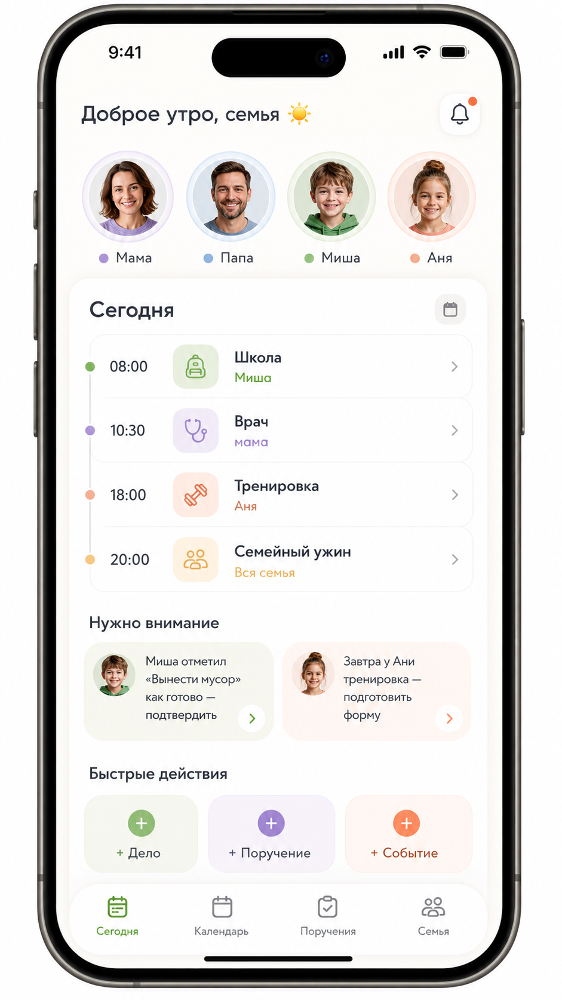
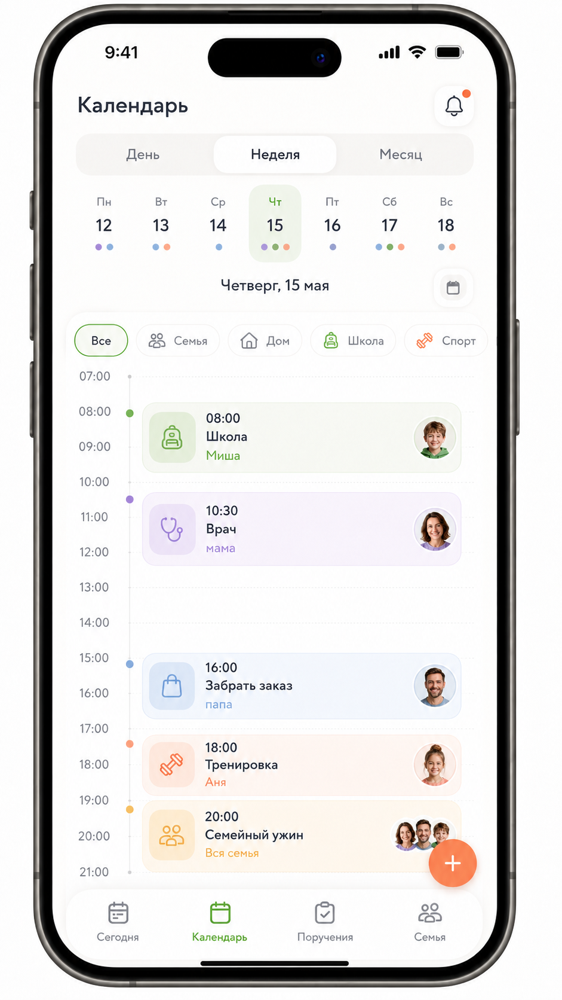
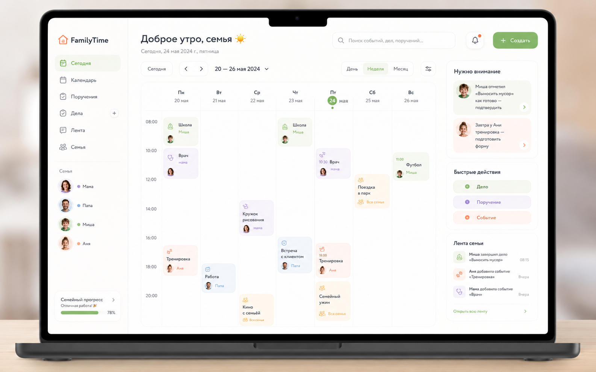

# Техническое задание для Codex: семейный календарь, дела и поручения

**Рабочее название:** `FamilyTime` / `Семейный Пульс`  
**Тип продукта:** приватная семейная PWA для расписания, дел и домашних поручений  
**Целевая инфраструктура:** VPS 1 vCPU 3.3 ГГц, 1 ГБ RAM, 15 ГБ NVMe  DEBIAN 22.04
**Основной язык интерфейса:** русский  
**Приоритет:** максимально дружелюбный, семейный, красивый интерфейс при лёгкой серверной архитектуре.

---

## 0. Визуальные референсы

Эти изображения использовать как **основной визуальный ориентир**. Не нужно копировать пиксель-в-пиксель, но нужно сохранить общий дизайн: тёплый минимализм, мягкие пастельные цвета, крупные скругления, много воздуха, семейные аватары, понятные карточки, спокойные анимации.

### Изображение 1 — мобильный экран «Сегодня»



Использовать как референс для:

- главного мобильного экрана;
- приветствия;
- блока членов семьи;
- дневной ленты событий;
- блока «Нужно внимание»;
- быстрых действий;
- нижней мобильной навигации.

### Изображение 2 — мобильный экран «Календарь / Неделя»



Использовать как референс для:

- мобильного календаря;
- переключателя `День / Неделя / Месяц`;
- компактной полосы недели;
- вертикальной временной шкалы;
- цветных карточек событий;
- фильтров категорий;
- floating action button.

### Изображение 3 — desktop-экран с недельным календарём



Использовать как референс для:

- desktop layout;
- левого sidebar;
- центральной недельной сетки календаря;
- правого sidebar с вниманием, быстрыми действиями и семейной лентой;
- адаптации мобильной дизайн-системы на ПК.

> Важно: текст в сгенерированных изображениях может содержать неточности. В приложении использовать чистый русский текст из этого ТЗ.

---

## 1. Цель продукта

Создать приватное веб-приложение для семьи, которое помогает координировать:

1. общее семейное расписание;
2. личные дела каждого члена семьи;
3. поручения друг другу по дому;
4. детские профили и родительский контроль;
5. повторяющиеся домашние рутины;
6. семейную ленту изменений;
7. напоминания и уведомления.

Продукт должен ощущаться не как корпоративный таск-трекер, а как **домашний центр спокойствия**: открыл — сразу понял, что сегодня происходит, кому что нужно сделать, где требуется внимание родителя.

---

## 2. Термины предметной области

### Семья

Изолированное пространство данных. Один пользователь может в будущем состоять в нескольких семьях, но MVP можно оптимизировать под одну активную семью на пользователя.

### Член семьи

Профиль внутри семьи. Может быть связан с полноценным auth-пользователем или быть управляемым детским профилем.

### Событие

Объект расписания с началом и концом.

Примеры:

- `08:00 Школа — Миша`
- `10:30 Врач — мама`
- `18:00 Тренировка — Аня`
- `20:00 Семейный ужин — вся семья`

### Дело

Задача, которую пользователь создаёт для себя. Может иметь дедлайн, чеклист, категорию и напоминание. Дело отличается от поручения тем, что инициатор и основной исполнитель — один и тот же человек.

Примеры:

- `Купить батарейки`
- `Позвонить врачу`
- `Собрать документы`

### Поручение

Задача, которую один член семьи создаёт для другого. У поручения есть назначенный исполнитель, статус и, опционально, подтверждение выполнения.

Примеры:

- мама поручает Мише: `Вынести мусор`;
- папа поручает Ане: `Собрать форму на тренировку`;
- ребёнок просит папу: `Починить велосипед`.

### Рутина

Повторяющееся дело, поручение или событие.

Примеры:

- каждый будний день в 08:00 — школа;
- каждый вторник и пятницу в 19:00 — вынести мусор;
- каждую субботу в 11:00 — уборка комнаты.

---

## 3. MVP: обязательный объём первой версии

### 3.1. Аккаунты и семья

- Регистрация и вход взрослого пользователя.
- Создание семейного пространства.
- Добавление членов семьи.
- Роли: `owner`, `parent`, `adult`, `teen`, `child`, `guest`.
- Родитель может создать детский профиль.
- Для каждого члена семьи: имя, аватар, цвет, роль.
- Смена активного члена семьи для действий от лица ребёнка родителем — только в родительских сценариях.

### 3.2. Главный экран «Сегодня»

Должен включать:

- приветствие;
- ряд аватаров семьи;
- список ближайших событий дня;
- рабочие виды календаря `День / Неделя / Месяц`;
- информационный all-day слой для дней рождения, праздников и особых дат;
- дела пользователя на сегодня;
- поручения пользователю;
- блок «Нужно внимание»;
- быстрые действия: `+ Дело`, `+ Поручение`, `+ Событие`.

### 3.3. Календарь

Вкладка `Календарь` в MVP является крупномасштабным навигатором:

- годовой обзор;
- сетка месяцев и дней;
- номера недель;
- переход по годам;
- выходные и государственные праздники;
- дни рождения;
- особые семейные, памятные и информационные даты.

Рабочие виды `День / Неделя / Месяц` живут во вкладке `Сегодня`, чтобы не дублировать два похожих календаря. События, дела и поручения по-прежнему запрашиваются по видимому диапазону дат.

Особые даты и праздники не являются делами или событиями со временем. Они отображаются как all-day информация о дне.

### 3.4. Дела

- Создание личного дела.
- Дедлайн или дата выполнения.
- Приоритет.
- Категория.
- Статусы: `todo`, `in_progress`, `done`, `cancelled`.
- Отображение в календаре, если есть дата или дедлайн.

### 3.5. Поручения

- Создание поручения для другого члена семьи.
- Выбор исполнителя.
- Срок выполнения.
- Комментарий.
- Флаг `нужно подтверждение`.
- Статусы:
  - `assigned`;
  - `accepted`;
  - `in_progress`;
  - `done`;
  - `approved`;
  - `rejected`;
  - `skipped`;
  - `overdue`;
  - `cancelled`.
- Для ребёнка показывать упрощённые статусы:
  - `Надо сделать`;
  - `Я сделал`;
  - `Ждёт проверки`;
  - `Готово`.

### 3.6. Семейная лента

Лента событий:

- создано событие;
- создано поручение;
- поручение выполнено;
- поручение подтверждено;
- событие перенесено;
- добавлен комментарий.

Лента должна быть видна на desktop справа и отдельным экраном на мобильном.

### 3.7. PWA

- Установка на экран Домой.
- Manifest.
- Service worker.
- Offline shell: приложение открывается без сети и показывает кэшированный каркас интерфейса.
- Offline draft для создания объекта можно оставить на post-MVP, но архитектуру не блокировать.

### 3.8. Уведомления

MVP:

- in-app уведомления;
- badge на иконке уведомлений;
- центр уведомлений;
- напоминания можно генерировать серверными cron-задачами.

Post-MVP:

- Web Push;
- iOS Home Screen web app push;
- digest утром/вечером.

---

## 4. Нецели первой версии

Не делать в MVP:

- многосемейный SaaS с публичной регистрацией для тысяч пользователей;
- оплату, тарифы, billing;
- Kubernetes, Redis, отдельный PostgreSQL;
- сложный чат;
- тяжёлую аналитику;
- нативное iOS/Android приложение;
- Apple Calendar / Google Calendar sync;
- голосовой ввод;
- AI-планирование.

Архитектуру проектировать так, чтобы эти функции можно было добавить позже, но не раздувать MVP.

---

## 5. Технический стек

### 5.1. Frontend

- SvelteKit.
- TypeScript.
- Svelte SPA/PWA build через static adapter.
- Tailwind CSS.
- Собственная дизайн-система поверх Tailwind.
- `@lucide/svelte` для иконок.
- GSAP для точечных анимаций.
- `pocketbase` JS SDK.
- `zod` для клиентской валидации форм.
- `date-fns` или аналогичная лёгкая библиотека для работы с датами.
- `rrule` для повторяющихся событий, если recurrence реализуется на клиенте или в shared utility.

### 5.2. Backend

- PocketBase как standalone backend.
- Встроенная SQLite-база PocketBase.
- PocketBase auth.
- PocketBase file storage для аватаров и вложений.
- PocketBase realtime для обновления ленты, уведомлений и календаря.
- PocketBase JavaScript hooks для серверной бизнес-логики.
- PocketBase cron-like jobs для напоминаний и генерации повторов.

### 5.3. Reverse proxy и production

- Caddy.
- Автоматический HTTPS.
- Static frontend files.
- Reverse proxy на PocketBase.
- systemd-сервис для PocketBase.
- регулярный backup `pb_data`.

### 5.4. Документация для сверки во время разработки

Codex должен сверять актуальный синтаксис и API через `context7` и официальные источники:

- SvelteKit adapter static / SPA fallback: `https://svelte.dev/docs/kit/adapter-static`
- SvelteKit SPA: `https://svelte.dev/docs/kit/single-page-apps`
- PocketBase docs: `https://pocketbase.io/docs/`
- PocketBase realtime: `https://pocketbase.io/docs/api-realtime/`
- PocketBase JS hooks: `https://pocketbase.io/docs/js-event-hooks/`
- Caddy reverse proxy: `https://caddyserver.com/docs/quick-starts/reverse-proxy`
- Caddy Automatic HTTPS: `https://caddyserver.com/docs/automatic-https`
- PWA docs: `https://developer.mozilla.org/en-US/docs/Web/Progressive_web_apps`
- Web app manifest: `https://developer.mozilla.org/en-US/docs/Web/Progressive_web_apps/Manifest`
- GSAP docs: `https://gsap.com/docs/v3/`
- Lucide Svelte: `https://lucide.dev/guide/svelte`
- Tailwind CSS: `https://tailwindcss.com/docs`

---

## 6. Архитектура приложения

### 6.1. Production-схема

```txt
Browser / PWA
    ↓ HTTPS
Caddy
    ├── /, /app/*, assets → static SvelteKit PWA
    ├── /api/*            → PocketBase API reverse proxy
    └── /_/*              → PocketBase admin UI reverse proxy, дополнительно защитить

PocketBase
    ├── SQLite
    ├── pb_data
    ├── pb_hooks
    ├── pb_migrations
    └── file storage
```

### 6.2. Почему такая схема

Текущий VPS ограничен: 1 vCPU, 1 ГБ RAM, 15 ГБ NVMe. Поэтому запрещено начинать с тяжёлой инфраструктуры. Frontend должен быть статическим, backend — одним лёгким процессом.

Целевые лимиты:

- PocketBase idle memory: держать максимально низко;
- frontend отдаётся Caddy как static files;
- без Node.js runtime в production, если нет отдельной необходимости;
- без постоянного polling, использовать realtime/SSE только на активных экранах;
- аватары и вложения оптимизировать;
- initial JS bundle держать компактным, тяжёлые экраны lazy-load.

---

## 7. Структура репозитория

```txt
family-time/
  AGENTS.md
  TECHNICAL_SPEC.md
  README.md
  package.json
  pnpm-lock.yaml

  apps/
    web/
      src/
        app.css
        app.d.ts
        lib/
          api/
          components/
          constants/
          design/
          stores/
          types/
          utils/
        routes/
        service-worker.ts
      static/
        icons/
        manifest.webmanifest
      svelte.config.js
      vite.config.ts
      package.json

  pocketbase/
    pb_hooks/
      auth.pb.js
      activity.pb.js
      items.pb.js
      notifications.pb.js
      recurrence.pb.js
    pb_migrations/
    pb_public/
    README.md

  deploy/
    Caddyfile
    family-pocketbase.service
    backup.sh
    restore.md

  docs/
    references/
      ui/
        image-1-mobile-today.png
        image-2-mobile-calendar-week.png
        image-3-desktop-week-dashboard.png
    product/
      user-flows.md
      permissions.md
    technical/
      data-model.md
      api.md
```

На старте можно держать `TECHNICAL_SPEC.md` и `AGENTS.md` в корне, а картинки — в `docs/references/ui/`.

---

## 8. Дизайн-система

### 8.1. Общий стиль

Название стиля: **warm minimal family UI**.

Характер:

- тёплый;
- спокойный;
- дружелюбный;
- семейный;
- не корпоративный;
- premium, но не холодный;
- похож на хорошо отполированную iOS/PWA-утилиту.

### 8.2. Цветовые токены

Использовать CSS variables. Значения можно уточнять при реализации, но базово придерживаться этих оттенков:

```css
:root {
  --color-bg: #fffaf3;
  --color-surface: #ffffff;
  --color-surface-soft: #fffdf8;
  --color-text: #242936;
  --color-text-muted: #747b8b;
  --color-text-soft: #9aa1ad;
  --color-border: #eee7dc;
  --color-shadow: 28 24 18;

  --color-green: #73b95f;
  --color-green-soft: #edf7e8;
  --color-green-ring: #dff0d8;

  --color-lavender: #a883dd;
  --color-lavender-soft: #f3eafa;
  --color-lavender-ring: #eadcf8;

  --color-blue: #7daee3;
  --color-blue-soft: #eaf3fd;
  --color-blue-ring: #dbeafb;

  --color-peach: #ff8a63;
  --color-peach-soft: #fff0e8;
  --color-peach-ring: #ffe0d4;

  --color-yellow: #e9a93f;
  --color-yellow-soft: #fff5df;

  --color-danger: #e35b5b;
  --color-danger-soft: #fff0f0;
}
```

### 8.3. Цвета членов семьи

```ts
export const MEMBER_COLORS = {
  mom: {
    label: 'Мама',
    accent: 'var(--color-lavender)',
    soft: 'var(--color-lavender-soft)',
    ring: 'var(--color-lavender-ring)'
  },
  dad: {
    label: 'Папа',
    accent: 'var(--color-blue)',
    soft: 'var(--color-blue-soft)',
    ring: 'var(--color-blue-ring)'
  },
  misha: {
    label: 'Миша',
    accent: 'var(--color-green)',
    soft: 'var(--color-green-soft)',
    ring: 'var(--color-green-ring)'
  },
  anya: {
    label: 'Аня',
    accent: 'var(--color-peach)',
    soft: 'var(--color-peach-soft)',
    ring: 'var(--color-peach-ring)'
  }
};
```

Пользовательские цвета должны быть настраиваемыми, но дефолты должны совпадать с референсами.

### 8.4. Категории

```ts
export const ITEM_CATEGORIES = [
  'family',
  'home',
  'school',
  'sport',
  'health',
  'shopping',
  'work',
  'money',
  'travel',
  'other'
] as const;
```

Маппинг:

| Категория | Цвет | Иконка Lucide | Русская подпись |
|---|---:|---|---|
| `family` | yellow | `UsersRound` | Семья |
| `home` | green | `House` | Дом |
| `school` | green | `Backpack` | Школа |
| `sport` | peach | `Dumbbell` | Спорт |
| `health` | lavender | `Stethoscope` | Здоровье |
| `shopping` | blue | `ShoppingBag` | Покупки |
| `work` | blue | `BriefcaseBusiness` | Работа |
| `money` | yellow | `WalletCards` | Финансы |
| `travel` | peach | `MapPinned` | Поездка |
| `other` | gray | `Sparkles` | Другое |

### 8.5. Радиусы, тени, отступы

```css
:root {
  --radius-xs: 8px;
  --radius-sm: 12px;
  --radius-md: 16px;
  --radius-lg: 22px;
  --radius-xl: 28px;
  --radius-2xl: 36px;

  --shadow-card: 0 14px 40px rgb(var(--color-shadow) / 0.08);
  --shadow-soft: 0 8px 24px rgb(var(--color-shadow) / 0.06);
  --shadow-floating: 0 18px 45px rgb(var(--color-shadow) / 0.16);
}
```

Правила:

- основные карточки: `22–28px`;
- маленькие chips: `999px`;
- иконка-контейнер: `48x48`, radius `16px`;
- FAB: `64x64`, radius `999px`;
- bottom nav: `28–36px` сверху.

### 8.6. Типографика

- Базовый шрифт: системный stack `Inter`, `SF Pro`, `system-ui`, `-apple-system`, `BlinkMacSystemFont`, `Segoe UI`, `sans-serif`.
- Поддержка кириллицы обязательна.
- Не использовать декоративные шрифты в MVP.

Рекомендуемая шкала:

```css
--font-size-xs: 12px;
--font-size-sm: 14px;
--font-size-md: 16px;
--font-size-lg: 18px;
--font-size-xl: 22px;
--font-size-2xl: 28px;
--font-size-3xl: 34px;
```

### 8.7. Иконки

Основной набор: `@lucide/svelte`.

Общие правила:

- размер основной иконки: `22–24px`;
- `strokeWidth`: `2` или `2.2`;
- цвет иконки наследуется от категории;
- иконки событий почти всегда помещать в pastel-контейнер;
- не полагаться только на цвет — всегда есть подпись, иконка или аватар.

---

## 9. Анимации

GSAP использовать точечно, не превращать интерфейс в анимационную демку.

### 9.1. Где использовать GSAP

- раскрытие bottom sheet создания объекта;
- появление карточек в Today feed;
- мягкий переход между масштабами календаря;
- drag/drop feedback в desktop-календаре;
- лёгкая celebratory-анимация для ребёнка после выполнения поручения;
- micro-interactions для FAB и quick action buttons.

### 9.2. Где не использовать GSAP

- для обычного hover, focus и простых transitions, если достаточно CSS;
- для критической бизнес-логики;
- для постоянных бесконечных анимаций;
- для layout, который можно сделать CSS Grid/Flex.

### 9.3. Accessibility

Если включён `prefers-reduced-motion: reduce`, отключить сложные анимации и оставить мгновенные/простые переходы.

```ts
export function prefersReducedMotion() {
  return window.matchMedia('(prefers-reduced-motion: reduce)').matches;
}
```

В Svelte-компонентах анимации создавать в `onMount`, чистить при `onDestroy`.

---

## 10. Адаптивность

### 10.1. Breakpoints

```ts
export const BREAKPOINTS = {
  mobile: 0,
  tablet: 768,
  desktop: 1024,
  wide: 1280
};
```

### 10.2. Mobile layout

- Один основной столбец.
- Bottom navigation.
- Floating action button или блок quick actions.
- Формы создания — bottom sheet.
- `Сегодня`: день/неделя — вертикальная временная шкала; месяц — компактная рабочая сетка.
- `Календарь`: годовая сетка месяцев и дней с week numbers и маркерами особых дат.

### 10.3. Tablet layout

- Возможна двухколоночная компоновка.
- Sidebar может быть compact rail.
- Calendar week должен использовать больше ширины, но не ломаться.

### 10.4. Desktop layout

- Левый sidebar.
- Центральный календарь.
- Правый sidebar.
- Верхняя панель с поиском и `+ Создать`.
- См. изображение 3.

---

## 11. Роутинг frontend

SvelteKit routes:

```txt
src/routes/
  +layout.svelte
  +page.svelte                      # redirect based on auth

  (auth)/
    login/+page.svelte
    register/+page.svelte
    invite/[code]/+page.svelte

  (app)/
    +layout.svelte                  # AppShell: mobile/desktop adaptive
    today/+page.svelte
    calendar/+page.svelte
    assignments/+page.svelte
    tasks/+page.svelte
    feed/+page.svelte
    family/+page.svelte
    family/[memberId]/+page.svelte
    notifications/+page.svelte
    settings/+page.svelte

  (child)/
    child/+page.svelte              # simplified child dashboard
```

Для SPA deployment все роуты должны корректно открываться при прямом заходе по URL через fallback.

---

## 12. Frontend-модули

```txt
src/lib/
  api/
    pocketbase.ts
    auth.api.ts
    families.api.ts
    members.api.ts
    items.api.ts
    occurrences.api.ts
    notifications.api.ts
    activity.api.ts

  components/
    app/
      AppShell.svelte
      DesktopShell.svelte
      MobileShell.svelte
      Sidebar.svelte
      BottomNav.svelte
      TopBar.svelte
      FloatingCreateButton.svelte

    family/
      MemberAvatar.svelte
      MemberAvatarRow.svelte
      MemberPicker.svelte
      FamilyMemberCard.svelte
      ChildModeCard.svelte
      RoleBadge.svelte

    calendar/
      CalendarViewport.svelte
      CalendarHeader.svelte
      CalendarViewSwitcher.svelte
      WeekStrip.svelte
      MonthGrid.svelte
      WeekGrid.svelte
      DayTimeline.svelte
      AgendaList.svelte
      TimeAxis.svelte
      NowLine.svelte
      EventCard.svelte
      OccurrenceCard.svelte
      CalendarFilters.svelte

    today/
      TodayHeader.svelte
      TodayTimeline.svelte
      AttentionPanel.svelte
      QuickActions.svelte
      TodayEmptyState.svelte

    items/
      ItemCard.svelte
      TaskCard.svelte
      AssignmentCard.svelte
      EventDetailsSheet.svelte
      StatusBadge.svelte
      PriorityBadge.svelte
      Checklist.svelte

    composer/
      ComposerSheet.svelte
      ComposerTabs.svelte
      EventForm.svelte
      TaskForm.svelte
      AssignmentForm.svelte
      RepeatRuleEditor.svelte
      ReminderPicker.svelte

    feed/
      ActivityFeed.svelte
      ActivityFeedItem.svelte

    notifications/
      NotificationBell.svelte
      NotificationInbox.svelte
      NotificationItem.svelte

    ui/
      Button.svelte
      Card.svelte
      Chip.svelte
      IconTile.svelte
      Modal.svelte
      Sheet.svelte
      SegmentedControl.svelte
      TextField.svelte
      Select.svelte
      DateTimeField.svelte
      Avatar.svelte
      EmptyState.svelte
      Skeleton.svelte

  constants/
    categories.ts
    colors.ts
    roles.ts
    routes.ts

  design/
    tokens.css
    icon-registry.ts

  stores/
    session.store.ts
    family.store.ts
    calendar.store.ts
    notifications.store.ts
    realtime.store.ts

  types/
    domain.ts
    pocketbase.ts

  utils/
    date.ts
    recurrence.ts
    permissions.ts
    image.ts
    validation.ts
```

---

## 13. Состояние приложения

### 13.1. Session state

Хранить:

- auth user;
- token validity;
- active family;
- active member;
- role;
- permissions summary.

### 13.2. Calendar state

Хранить:

- active view: `agenda | day | week | month | year`;
- selected date;
- visible range;
- active filters;
- loaded occurrences by range;
- loading/error state.

### 13.3. Realtime state

- подписка на `notifications` для текущего пользователя;
- подписка на `item_activity` активной семьи;
- подписка на `item_occurrences` только для видимого диапазона календаря или Today;
- отписываться при уходе с экрана.

---

## 14. Backend: модель данных PocketBase

Все коллекции, кроме системных, должны иметь поле `family`, если данные принадлежат семье. Все запросы должны быть family-scoped.

### 14.1. `users`

Использовать встроенную auth collection PocketBase.

Дополнительные поля:

| Поле | Тип | Описание |
|---|---|---|
| `display_name` | text | Имя пользователя |
| `locale` | select | `ru`, позже другие |
| `timezone` | text | Например `Europe/Amsterdam` |
| `onboarding_completed` | bool | Завершил ли onboarding |

Аватары лучше хранить в `family_members`, потому что в разных семьях у одного user может быть разный профиль.

### 14.2. `families`

| Поле | Тип | Обяз. | Описание |
|---|---|---:|---|
| `name` | text | да | Название семьи |
| `slug` | text | да | Человекочитаемый slug, уникальный |
| `timezone` | text | да | Timezone семьи |
| `owner_user` | relation -> users | да | Создатель семьи |
| `theme_json` | json | нет | Настройки темы |
| `settings_json` | json | нет | Семейные настройки |
| `created` | auto | да | created |
| `updated` | auto | да | updated |

Индексы:

- unique `slug`;
- index `owner_user`.

### 14.3. `family_members`

| Поле | Тип | Обяз. | Описание |
|---|---|---:|---|
| `family` | relation -> families | да | Семья |
| `user` | relation -> users | нет | Auth-пользователь, если есть |
| `display_name` | text | да | Имя в семье |
| `role` | select | да | `owner`, `parent`, `adult`, `teen`, `child`, `guest` |
| `avatar` | file | нет | Фото |
| `color_key` | select | нет | `lavender`, `blue`, `green`, `peach`, etc. |
| `color_hex` | text | нет | кастомный цвет |
| `birthday` | date | нет | День рождения |
| `managed_by` | relation -> family_members, multiple | нет | Кто управляет детским профилем |
| `is_child_login_enabled` | bool | да | Может ли ребёнок входить сам |
| `notification_settings_json` | json | нет | Настройки уведомлений |
| `active` | bool | да | Активен ли профиль |
| `created_by` | relation -> family_members | нет | Кто создал профиль |

Индексы:

- `family`;
- `user`;
- composite `family + user` для быстрого поиска членства.

### 14.4. `items`

Главная коллекция логических объектов: событие, дело, поручение, рутина.

| Поле | Тип | Обяз. | Описание |
|---|---|---:|---|
| `family` | relation -> families | да | Семья |
| `kind` | select | да | `event`, `task`, `assignment`, `routine` |
| `title` | text | да | Название |
| `description` | editor/text | нет | Описание |
| `created_by` | relation -> family_members | да | Автор |
| `owner` | relation -> family_members | нет | Владелец дела |
| `assignees` | relation -> family_members, multiple | нет | Исполнители поручения |
| `participants` | relation -> family_members, multiple | нет | Участники события |
| `category` | select | да | Категория |
| `priority` | select | да | `low`, `normal`, `high`, `urgent` |
| `visibility` | select | да | `private`, `assignees`, `family`, `adults` |
| `all_day` | bool | да | Весь день |
| `start_at` | date | нет | Начало для event |
| `end_at` | date | нет | Конец для event |
| `due_at` | date | нет | Дедлайн для task/assignment |
| `timezone` | text | да | Timezone объекта |
| `recurrence_rule` | text | нет | RRULE или собственный формат |
| `recurrence_until` | date | нет | Конец повтора |
| `recurrence_exdates_json` | json | нет | Исключения |
| `approval_required` | bool | да | Нужно подтверждение |
| `checklist_json` | json | нет | Чеклист |
| `points` | number | нет | Баллы для детского режима |
| `location_text` | text | нет | Место |
| `color_override` | text | нет | Цвет вручную |
| `attachments` | file, multiple | нет | Вложения |
| `archived` | bool | да | Архив |
| `created` | auto | да | created |
| `updated` | auto | да | updated |

Индексы:

- `family`;
- `kind`;
- `created_by`;
- `owner`;
- `start_at`;
- `due_at`;
- `updated`.

### 14.5. `item_occurrences`

Материализованные экземпляры объектов для календаря и статусов. Даже нерегулярный item должен иметь один occurrence. Это упрощает запросы календаря.

| Поле | Тип | Обяз. | Описание |
|---|---|---:|---|
| `family` | relation -> families | да | Семья |
| `item` | relation -> items | да | Родительский item |
| `kind` | select | да | Дублируется для быстрых фильтров |
| `title_snapshot` | text | да | Название на момент генерации |
| `category_snapshot` | select | да | Категория на момент генерации |
| `start_at` | date | нет | Начало occurrence |
| `end_at` | date | нет | Конец occurrence |
| `due_at` | date | нет | Дедлайн occurrence |
| `all_day` | bool | да | Весь день |
| `status` | select | да | Статус экземпляра |
| `completed_by` | relation -> family_members | нет | Кто отметил выполненным |
| `completed_at` | date | нет | Когда выполнено |
| `approved_by` | relation -> family_members | нет | Кто подтвердил |
| `approved_at` | date | нет | Когда подтверждено |
| `rejected_by` | relation -> family_members | нет | Кто вернул |
| `rejected_at` | date | нет | Когда возвращено |
| `rejection_reason` | text | нет | Причина возврата |
| `skipped_by` | relation -> family_members | нет | Кто пропустил |
| `skipped_reason` | text | нет | Причина пропуска |
| `override_json` | json | нет | Изменения конкретного occurrence |

Индексы:

- composite `family + start_at`;
- composite `family + due_at`;
- composite `family + status`;
- `item`.

### 14.6. `item_comments`

| Поле | Тип | Обяз. | Описание |
|---|---|---:|---|
| `family` | relation -> families | да | Семья |
| `item` | relation -> items | да | Item |
| `occurrence` | relation -> item_occurrences | нет | Конкретный occurrence |
| `author` | relation -> family_members | да | Автор |
| `text` | text | нет | Текст |
| `emoji` | text | нет | Короткая реакция |
| `attachments` | file, multiple | нет | Вложения |

### 14.7. `item_activity`

| Поле | Тип | Обяз. | Описание |
|---|---|---:|---|
| `family` | relation -> families | да | Семья |
| `item` | relation -> items | нет | Item |
| `occurrence` | relation -> item_occurrences | нет | Occurrence |
| `actor` | relation -> family_members | да | Кто сделал действие |
| `action` | select | да | Тип действия |
| `summary` | text | да | Короткий текст для ленты |
| `old_value_json` | json | нет | До |
| `new_value_json` | json | нет | После |
| `created` | auto | да | Время |

`action`:

```ts
export type ActivityAction =
  | 'item.created'
  | 'item.updated'
  | 'item.deleted'
  | 'occurrence.created'
  | 'occurrence.rescheduled'
  | 'assignment.assigned'
  | 'assignment.accepted'
  | 'assignment.done'
  | 'assignment.approved'
  | 'assignment.rejected'
  | 'assignment.skipped'
  | 'comment.created'
  | 'member.created'
  | 'member.updated';
```

### 14.8. `notifications`

| Поле | Тип | Обяз. | Описание |
|---|---|---:|---|
| `family` | relation -> families | да | Семья |
| `recipient_member` | relation -> family_members | да | Получатель |
| `recipient_user` | relation -> users | нет | Auth-пользователь получателя |
| `type` | select | да | Тип уведомления |
| `title` | text | да | Заголовок |
| `body` | text | да | Тело |
| `item` | relation -> items | нет | Связанный item |
| `occurrence` | relation -> item_occurrences | нет | Связанный occurrence |
| `read_at` | date | нет | Прочитано |
| `delivered_at` | date | нет | Доставлено push |
| `created` | auto | да | created |

### 14.9. `push_subscriptions`

Post-MVP, но коллекцию можно подготовить.

| Поле | Тип | Обяз. | Описание |
|---|---|---:|---|
| `family` | relation -> families | да | Семья |
| `user` | relation -> users | да | User |
| `member` | relation -> family_members | нет | Активный member |
| `endpoint` | text | да | Push endpoint |
| `keys_json` | json | да | Keys |
| `device_label` | text | нет | Например `iPhone Миши` |
| `platform` | select | нет | `ios`, `android`, `desktop`, `unknown` |
| `active` | bool | да | Активна |
| `last_used_at` | date | нет | Последнее использование |

### 14.10. `invitations`

| Поле | Тип | Обяз. | Описание |
|---|---|---:|---|
| `family` | relation -> families | да | Семья |
| `code` | text | да | Invite code |
| `role` | select | да | Роль после входа |
| `email` | email/text | нет | Email приглашённого |
| `created_by` | relation -> family_members | да | Кто создал |
| `expires_at` | date | да | Истекает |
| `used_by_user` | relation -> users | нет | Кто использовал |
| `used_at` | date | нет | Когда использовано |
| `revoked_at` | date | нет | Когда отозвано |

### 14.11. `chore_templates`

Можно реализовать через `items.kind = routine`, но отдельная коллекция удобна для раздела «Дом».

| Поле | Тип | Обяз. | Описание |
|---|---|---:|---|
| `family` | relation -> families | да | Семья |
| `title` | text | да | Название рутины |
| `category` | select | да | Категория |
| `default_assignee` | relation -> family_members | нет | Исполнитель по умолчанию |
| `recurrence_rule` | text | да | Повтор |
| `approval_required` | bool | да | Нужно подтверждение |
| `points` | number | нет | Баллы |
| `active` | bool | да | Активна |

---

## 15. Права доступа

### 15.1. Основные правила

- Пользователь видит только семьи, где он является `family_member.user`.
- Родитель видит и управляет профилями детей, где он указан в `managed_by`.
- `owner` может управлять всеми настройками семьи.
- `parent` может создавать детям расписание и поручения.
- `adult` может создавать семейные события и поручения, если это разрешено настройками семьи.
- `teen` может создавать личные дела и события, а поручения другим — только если разрешено.
- `child` видит упрощённый интерфейс и только свои объекты плюс семейные события, разрешённые видимостью.
- `guest` видит только явно назначенные/приглашённые события.

### 15.2. Visibility

`visibility` определяет базовую видимость item:

| Значение | Кто видит |
|---|---|
| `private` | автор и owner |
| `assignees` | автор, assignees, participants, родители управляемых детей |
| `family` | все активные члены семьи |
| `adults` | owner, parent, adult |

### 15.3. Серверная проверка обязательна

Не полагаться только на клиент. Все критичные проверки прав реализовать в PocketBase hooks.

Минимальные helper-функции в `pb_hooks`:

```js
function requireAuth(e) {}
function getCurrentUser(e) {}
function getCurrentMember(e, familyId) {}
function requireFamilyAccess(e, familyId) {}
function canCreateItem(member, payload) {}
function canUpdateItem(member, existing, patch) {}
function canTransitionOccurrence(member, occurrence, nextStatus) {}
function canViewItem(member, item) {}
```

Collection API rules в PocketBase должны быть максимально консервативными; сложную бизнес-логику держать в hooks.

---

## 16. Бизнес-логика items

### 16.1. Создание события

При создании `items.kind = event`:

1. Проверить права автора.
2. Проверить `title`.
3. Проверить `start_at` и `end_at`.
4. Если `end_at < start_at` — ошибка.
5. Если `participants` пустой, по умолчанию поставить `created_by`.
6. Нормализовать даты в UTC.
7. Создать `item_occurrences`:
   - один occurrence для нерегулярного события;
   - несколько occurrences на ближайший период для recurrence.
8. Создать запись `item_activity`.
9. Создать notifications для участников, кроме автора.

### 16.2. Создание дела

При создании `items.kind = task`:

1. `owner` по умолчанию = `created_by`.
2. `assignees` не использовать или держать пустым.
3. Если есть `due_at`, создать occurrence.
4. Если даты нет — occurrence можно создать без даты и показывать в списке задач, но не в календарной сетке.
5. Статус occurrence по умолчанию: `todo`.

### 16.3. Создание поручения

При создании `items.kind = assignment`:

1. `created_by` не должен совпадать с единственным `assignee`, иначе предложить создать `task`.
2. Должен быть минимум один assignee.
3. Если assignee — ребёнок, проверить право автора ставить поручение этому ребёнку.
4. Если `approval_required = true`, после `done` статус должен идти в ожидание подтверждения.
5. Стартовый статус occurrence: `assigned`.
6. Создать уведомление исполнителю.

### 16.4. Статусные переходы поручения

```txt
assigned → accepted
assigned → in_progress
assigned → done
accepted → in_progress
accepted → done
in_progress → done

done → approved       если approval_required = true и подтверждает родитель/автор

done → rejected       если approval_required = true и автор/родитель возвращает
rejected → in_progress
rejected → done

assigned|accepted|in_progress → skipped
assigned|accepted|in_progress → cancelled
```

Если `approval_required = false`, после `done` можно автоматически считать поручение завершённым.

### 16.5. Overdue

Cron-задача периодически помечает occurrence как `overdue`, если:

- `due_at < now`;
- status не финальный;
- status не `done`, ожидающий подтверждения.

Для UI лучше не кричать «Просрочено!», а писать мягко:

- `Нужна помощь: срок прошёл`;
- `Пора напомнить`;
- `Ждёт внимания`.

---

## 17. Повторяющиеся события и поручения

### 17.1. Подход

Использовать материализацию occurrences на скользящее окно.

Рекомендуемое окно:

- генерировать occurrences на 60 дней вперёд;
- хранить прошлые occurrences не меньше 180 дней;
- cron ежедневно догенерирует недостающие occurrences.

### 17.2. Почему не только RRULE на клиенте

Календарю нужны быстрые запросы по диапазону дат. Для PocketBase/SQLite проще и надёжнее запрашивать `item_occurrences`, чем каждый раз вычислять повторения на клиенте.

### 17.3. Изменение одного occurrence

Для изменения только одного повтора:

- не менять родительский item;
- записать override в `item_occurrences.override_json`;
- при необходимости добавить дату в `items.recurrence_exdates_json` и создать отдельный item-override.

В MVP можно ограничиться изменением всей серии или удалением всей серии. Но структура должна позволять instance override позже.

---

## 18. Realtime

### 18.1. Подписки

При активной семье:

- `notifications` для текущего `recipient_member`;
- `item_activity` для текущей семьи;
- `item_occurrences` для видимого диапазона календаря;
- `items` только при открытой карточке item или редакторе.

### 18.2. Правила

- Не держать лишние подписки на скрытых экранах.
- На мобильном календаре подписываться только на текущий видимый диапазон.
- На Today подписываться на today range + attention items.
- При смене семьи отписаться от старых каналов.

---

## 19. Экран «Сегодня»

### 19.1. Mobile UI

См. изображение 1.

Обязательные блоки сверху вниз:

1. header:
   - `Доброе утро, семья ☀️` или аналог по времени суток;
   - notification bell.
2. family avatar row:
   - мама, папа, дети;
   - цветовые точки;
   - активный фильтр по member при нажатии.
3. card `Сегодня`:
   - timeline list;
   - 4–6 ближайших событий;
   - переключение `День / Неделя / Месяц`;
   - all-day информация о выбранном дне;
   - кнопка перехода в годовой календарь.
4. `Нужно внимание`:
   - подтверждения;
   - просроченные поручения;
   - события завтра, которые требуют подготовки.
5. `Быстрые действия`:
   - `+ Дело`;
   - `+ Поручение`;
   - `+ Событие`.
6. bottom nav.

### 19.2. Desktop UI

На desktop экран Today и Calendar могут быть объединены:

- слева navigation;
- в центре календарная неделя;
- справа attention/actions/feed.

См. изображение 3.

### 19.3. Acceptance criteria

- Пользователь за 3 секунды понимает, что происходит сегодня.
- Создание дела/поручения/события доступно с первого экрана.
- Никакой блок не выглядит как корпоративная CRM.
- Аватары используются в событиях и карточках внимания.

---

## 20. Экран «Календарь»

### 20.1. Назначение

`Календарь` — это годовой навигатор и слой особых дат. Он не повторяет рабочий day/week/month календарь из `Сегодня`.

MVP:

- годовой обзор;
- 12 месяцев;
- дни и номера недель;
- выходные;
- государственные праздники;
- дни рождения;
- семейные и памятные даты;
- переход в `Сегодня` на выбранный день или месяц.

Post-MVP:

- zoom между годом, месяцем и неделей;
- richer heatmap/summary по семейной нагрузке;
- импорт внешних календарей.

### 20.2. Day annotations

Особые даты хранятся отдельно от `items`.

Типы:

- `birthday`;
- `public_holiday`;
- `family_date`;
- `observance`;
- `memorial`.

Правила:

- дни рождения и особые даты могут повторяться бессрочно каждый год;
- для дней рождения можно выбрать члена семьи или вручную указать внешнего человека;
- для внешнего человека поля `person_relation` и `person_contact` опциональны;
- при известном годе рождения можно показывать возраст;
- государственные праздники read-only и подтягиваются из проверяемого внешнего источника раз в неделю;
- manual annotations можно редактировать и удалять.

### 20.3. Visual rules

- выходные — мягкая подложка;
- государственные праздники — системный маркер;
- день рождения члена семьи — аватар или инициал участника;
- внешний день рождения — инициал в выбранном цвете;
- особая дата — точка или тонкая плашка выбранного цвета;
- памятная/грустная дата — приглушённый тон, без праздничной анимации;
- если маркеров больше 2–3, показывать `+N` и раскрывать детали дня.

### 20.4. Event card requirements

Карточка события должна содержать:

- иконку категории;
- время;
- название;
- имя участника или `Вся семья`;
- avatar/stack avatars;
- цвет категории или члена семьи;
- accessible label.

### 20.5. Drag/drop

MVP:

- desktop drag/drop можно отложить, но компоненты проектировать так, чтобы добавить.

Post-MVP:

- drag event to change time;
- resize event duration;
- confirmation sheet after move;
- optimistic update + rollback.

---

## 21. Composer: создание дела, поручения, события

### 21.1. Общий UX

Одна точка входа: `+ Создать` или FAB. После открытия пользователь выбирает тип:

```txt
[ Событие ] [ Дело ] [ Поручение ]
```

Форму показывать как:

- mobile: bottom sheet;
- desktop: modal / side panel.

### 21.2. Event form

Поля:

- title;
- category;
- participants;
- start date/time;
- end date/time;
- all-day;
- repeat;
- reminder;
- location;
- visibility;
- description.

### 21.3. Task form

Поля:

- title;
- owner = current member;
- due date/time;
- priority;
- category;
- checklist;
- visibility;
- reminder;
- description.

### 21.4. Assignment form

Поля:

- title;
- assignee;
- due date/time;
- approval required;
- repeat;
- points;
- category;
- description;
- reminder.

### 21.5. Quick create

На мобильном quick action `+ Поручение` должен позволять создать поручение за 2–3 шага:

1. выбрать человека;
2. написать поручение;
3. выбрать срок из быстрых вариантов: `Сегодня`, `Завтра`, `На выходных`, `Выбрать`.

---

## 22. Детский режим

### 22.1. Цель

Ребёнку не нужен сложный календарь и корпоративные статусы. Ему нужны крупные понятные карточки.

### 22.2. UI

Экран ребёнка:

```txt
Привет, Миша 👋

Твои дела сегодня

[ 🗑 Вынести мусор ]
Кнопка: Я сделал

[ 🎒 Собрать рюкзак ]
Кнопка: Готово

Твоё расписание
08:00 Школа
18:00 Футбол
```

### 22.3. Ограничения

- Ребёнок не видит взрослые/private/adults объекты.
- Ребёнок не может менять семейные настройки.
- Ребёнок не может удалить поручение.
- Если `approval_required`, кнопка переводит статус в `done`, а родителю создаётся уведомление.

---

## 23. Уведомления

### 23.1. In-app notifications

Типы:

```ts
export type NotificationType =
  | 'assignment.created'
  | 'assignment.due_soon'
  | 'assignment.done_waiting_approval'
  | 'assignment.approved'
  | 'assignment.rejected'
  | 'event.reminder'
  | 'event.changed'
  | 'comment.created'
  | 'digest.morning'
  | 'digest.evening';
```

### 23.2. Notification Bell

- Показывает badge, если есть непрочитанные.
- Нажатие открывает inbox.
- В inbox можно отметить все прочитанными.

### 23.3. Web Push post-MVP

Подготовить архитектуру:

- VAPID keys в env/config;
- `push_subscriptions`;
- service worker push handler;
- разрешения только после понятного onboarding;
- отдельный onboarding для iOS Home Screen web app.

---

## 24. PWA

### 24.1. Manifest

`static/manifest.webmanifest`:

```json
{
  "name": "FamilyTime",
  "short_name": "FamilyTime",
  "description": "Семейный календарь, дела и поручения",
  "start_url": "/app/today",
  "scope": "/",
  "display": "standalone",
  "background_color": "#fffaf3",
  "theme_color": "#73b95f",
  "orientation": "portrait-primary",
  "icons": [
    {
      "src": "/icons/icon-192.png",
      "sizes": "192x192",
      "type": "image/png"
    },
    {
      "src": "/icons/icon-512.png",
      "sizes": "512x512",
      "type": "image/png"
    },
    {
      "src": "/icons/maskable-512.png",
      "sizes": "512x512",
      "type": "image/png",
      "purpose": "maskable"
    }
  ]
}
```

### 24.2. Offline behavior

MVP:

- app shell cached;
- последний открытый Today/Calendar можно показать из memory/local cache;
- при offline показывать banner `Нет сети — показываем сохранённые данные`.

Post-MVP:

- offline create drafts;
- sync queue;
- conflict resolution.

---

## 25. API layer frontend

Все обращения к PocketBase изолировать в `src/lib/api/*`.

Пример:

```ts
// src/lib/api/items.api.ts
export async function createAssignment(input: CreateAssignmentInput) {}
export async function createTask(input: CreateTaskInput) {}
export async function createEvent(input: CreateEventInput) {}
export async function updateOccurrenceStatus(input: UpdateOccurrenceStatusInput) {}
export async function getOccurrences(range: DateRange, filters: CalendarFilters) {}
export async function getTodaySummary(date: Date) {}
```

Компоненты UI не должны напрямую собирать сложные PocketBase-запросы.

---

## 26. Валидация

Использовать Zod-схемы в shared frontend validation.

Примеры:

```ts
const titleSchema = z.string().trim().min(1).max(120);

const createAssignmentSchema = z.object({
  title: titleSchema,
  assigneeIds: z.array(z.string()).min(1),
  dueAt: z.string().datetime().optional(),
  category: z.enum(ITEM_CATEGORIES),
  approvalRequired: z.boolean().default(true),
  description: z.string().max(2000).optional()
});
```

Серверная валидация в PocketBase hooks обязательна даже при клиентской Zod-валидации.

---

## 27. Поиск

MVP:

- search bar на desktop;
- поиск по title/description в пределах активной семьи;
- типы: events/tasks/assignments.

Post-MVP:

- fuzzy search;
- быстрый command palette;
- поиск по людям и категориям.

---

## 28. Доступность

Обязательные требования:

- Все интерактивные элементы доступны с клавиатуры.
- Focus states видимые.
- Цвет не является единственным способом передачи смысла.
- Кнопки имеют понятные `aria-label`, если нет текста.
- Bottom sheet закрывается по Escape на desktop.
- Модальные окна trap focus.
- Минимальный размер tap target на mobile: 44x44 px.
- Учитывать `prefers-reduced-motion`.

---

## 29. Ошибки и empty states

Тональность дружелюбная.

Примеры:

```txt
Сегодня пока спокойно
На этот день ничего не запланировано.

Поручений нет
Можно выдохнуть или добавить новое.

Не удалось сохранить
Проверьте подключение и попробуйте ещё раз.
```

Не использовать агрессивные сообщения типа `Ошибка!`, `Просрочено!`, `Неверно!` без контекста.

---

## 30. Безопасность

### 30.1. Auth

- Использовать PocketBase auth.
- Пароли не хранить самостоятельно.
- Сессии обновлять штатными средствами SDK.
- Не хранить auth token в небезопасных кастомных местах, если SDK уже управляет auth store.

### 30.2. Family isolation

- Любой запрос должен быть scoped by family.
- Любой create/update/delete должен проверять роль текущего member.
- Нельзя доверять `memberId`, переданному клиентом, без проверки принадлежности к семье.

### 30.3. Admin UI

PocketBase admin path `/_/`:

- проксировать только при необходимости;
- защитить дополнительно через Caddy Basic Auth или allowlist;
- использовать сильный пароль админа.

### 30.4. Files

- Ограничить типы файлов для avatar: `image/jpeg`, `image/png`, `image/webp`.
- Ограничить размер avatar, например до 2 МБ.
- Вложения post-MVP ограничить до разумного размера.

---

## 31. Backups

Обязательно для production:

- ежедневный backup `pb_data`;
- хранить минимум 7 дневных копий;
- желательно еженедельные копии за месяц;
- off-site backup, если будет возможность;
- документированный restore-процесс.

`deploy/backup.sh` должен:

1. остановить PocketBase или использовать встроенный backup API;
2. создать архив;
3. проверить размер;
4. удалить старые backups по retention;
5. залогировать результат.

---

## 32. Deployment

### 32.1. Caddyfile

```caddyfile
family.example.com {
    encode zstd gzip

    handle /api/* {
        reverse_proxy 127.0.0.1:8090
    }

    handle /_/* {
        reverse_proxy 127.0.0.1:8090
    }

    root * /var/www/family-time
    try_files {path} /index.html
    file_server
}
```

Если SvelteKit static fallback генерирует `200.html`, Caddy `try_files` нужно настроить под фактический fallback-файл.

### 32.2. systemd PocketBase

```ini
[Unit]
Description=FamilyTime PocketBase
After=network.target

[Service]
Type=simple
User=familytime
Group=familytime
WorkingDirectory=/opt/familytime/pocketbase
ExecStart=/opt/familytime/pocketbase/pocketbase serve --http=127.0.0.1:8090
Restart=on-failure
RestartSec=5
LimitNOFILE=4096

[Install]
WantedBy=multi-user.target
```

### 32.3. Build/deploy frontend

```bash
cd apps/web
pnpm install
pnpm build
rsync -av --delete build/ user@server:/var/www/family-time/
```

---

## 33. Производительность

### 33.1. Frontend

- Lazy-load calendar heavy components.
- Lazy-load GSAP only where needed.
- Use SVG icons as tree-shaken components.
- Do not import full icon packs.
- Optimize avatars.
- Use CSS containment where useful in large calendar grids.
- Avoid rerendering full week grid for every hover.

### 33.2. Backend

- Query occurrences by indexed date ranges.
- Avoid loading all family history for Today.
- Realtime subscriptions only for active ranges.
- Activity feed paginate.
- Notifications paginate.

### 33.3. Data retention

MVP can keep all history. Later add archive/cleanup for old activity events.

---

## 34. Тестирование

### 34.1. Unit tests

Покрыть:

- date range calculation;
- recurrence generation;
- permission helpers;
- status transitions;
- validation schemas;
- category/icon mapping.

### 34.2. Component tests

Покрыть:

- `MemberAvatar`;
- `EventCard`;
- `AssignmentCard`;
- `SegmentedControl`;
- `ComposerSheet`;
- `TodayTimeline`.

### 34.3. E2E tests

Покрыть критичные сценарии:

1. взрослый создаёт семью;
2. родитель добавляет ребёнка;
3. родитель создаёт поручение ребёнку;
4. ребёнок отмечает поручение как выполненное;
5. родитель подтверждает;
6. событие отображается в Today и Calendar;
7. desktop layout открывает week calendar.

---

## 35. Seed data для разработки

Создать seed-данные, совпадающие с референсами:

Семья:

- Мама — lavender;
- Папа — blue;
- Миша — green;
- Аня — peach.

События:

- `08:00 Школа — Миша`, категория `school`;
- `10:30 Врач — мама`, категория `health`;
- `16:00 Забрать заказ — папа`, категория `shopping`;
- `18:00 Тренировка — Аня`, категория `sport`;
- `20:00 Семейный ужин — вся семья`, категория `family`.

Attention:

- `Миша отметил «Вынести мусор» как готово — подтвердить`;
- `Завтра у Ани тренировка — подготовить форму`.

Feed:

- `Миша завершил дело «Вынести мусор»`;
- `Аня добавила событие «Тренировка»`;
- `Мама добавила событие «Врач»`.

---

## 36. Implementation milestones

### Milestone 0 — project skeleton

- Создать monorepo.
- Настроить SvelteKit + TypeScript + Tailwind.
- Настроить базовый AppShell.
- Добавить дизайн-токены.
- Подключить Lucide.
- Подготовить PocketBase директории.
- Добавить reference images в `docs/references/ui`.

### Milestone 1 — auth and family

- Регистрация/логин.
- Создание семьи.
- Создание family members.
- Роли.
- Seed data.

### Milestone 2 — Today UI

- Mobile Today по изображению 1.
- Desktop right attention panels по изображению 3.
- Quick actions без полной бизнес-логики или с базовой.

### Milestone 3 — items and occurrences

- Коллекции `items`, `item_occurrences`.
- Создание event/task/assignment.
- Hooks для occurrence generation.
- Статусы поручений.

### Milestone 4 — calendar

- Mobile calendar по изображению 2.
- Desktop week calendar по изображению 3.
- Range queries.
- Filters.

### Milestone 5 — activity and notifications

- `item_activity`.
- `notifications`.
- Realtime updates.
- Notification inbox.

### Milestone 6 — PWA and production

- Manifest.
- Service worker.
- Caddyfile.
- systemd service.
- backup script.
- deployment docs.

---

## 37. Definition of Done

Фича считается готовой, если:

- реализована по этому ТЗ;
- не ломает mobile и desktop layouts;
- не нарушает family isolation;
- есть loading/error/empty states;
- есть базовая доступность;
- визуально соответствует референсам;
- нет прямых PocketBase-запросов в глубине UI-компонентов, если они должны быть в API layer;
- прошли `pnpm check`, `pnpm lint`, `pnpm test`, `pnpm build`, если эти команды уже настроены;
- документация обновлена, если изменилась архитектура.

---

## 38. Приоритеты при спорных решениях

1. Простота и надёжность на маленьком VPS.
2. Безопасная изоляция семейных данных.
3. Дружелюбный UX.
4. Красивый визуал по референсам.
5. Быстрое создание дела/поручения/события.
6. Поддерживаемый код.
7. Расширяемость без premature overengineering.

---

## 39. Короткая формула продукта для Codex

Разрабатываем не таск-трекер, а **семейный пульт управления днём**.

Главные действия:

```txt
1. Создать событие в расписании.
2. Создать дело для себя.
3. Дать поручение члену семьи.
4. Увидеть, что сегодня важно.
5. Подтвердить выполнение ребёнком.
```

Главное визуальное правило:

```txt
Тёплый семейный минимализм: аватары, пастель, мягкие карточки, крупные кнопки, спокойствие.
```
